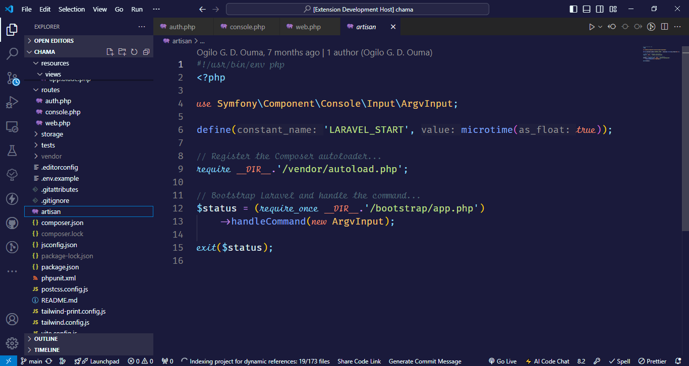

# MEA Theme for Visual Studio Code



**Mea Theme** is a modern and vibrant dark theme for Visual Studio Code. Carefully crafted with a rich indigo base, it enhances readability and reduces eye strain, delivering a comfortable and elegant coding experience.

---

## ✨ Features

- 🎨 **Dark Mode**: Elegant dark background with subtle contrast for better focus and eye comfort.
- 🧠 **Enhanced Syntax Highlighting**: Distinctive and clear highlighting for a wide range of languages and file types.
- ⚙️ **Customizable**: Easily tweak your theme with VS Code’s built-in color customization features.

---

## 📦 Installation

### Option 1: From the VS Code Marketplace

> _(Recommended for most users)_

1. Open **Visual Studio Code**.
2. Navigate to the **Extensions** sidebar (`Ctrl+Shift+X`).
3. Search for `MEA Theme`.
4. Click **Install**.

> _Note: This method requires the theme to be published to the marketplace._

---

### Option 2: From GitHub (Manual Installation)

> For contributors or users who want to install the theme directly from source.

#### Prerequisites

- [Node.js](https://nodejs.org) and npm installed.
- VS Code CLI (`code`) available in your terminal.
- `vsce` (Visual Studio Code Extension CLI) installed globally:
  ```bash
  npm install -g @vscode/vsce
  ```

#### Steps

```bash
# Clone the theme repository
git clone https://github.com/gogilo2003/mea-theme.git

# Navigate into the directory
cd mea-theme

# Package the theme into a VSIX file
vsce package

# Install the packaged theme into VS Code
code --install-extension mea-theme-0.0.1.vsix
```

> Replace `mea-theme-0.0.1.vsix` with the actual file name generated.

Once installed, activate the theme:

- Open the **Command Palette** (`Ctrl+Shift+P`)
- Run `Preferences: Color Theme`
- Select `MEA Theme`

---

## 🛠 Development

Feel free to fork, improve, or suggest new ideas. To test changes while developing:

```bash
# Run VS Code in Extension Development mode
code .
```

Then press `F5` to open a new Extension Development Host window where you can test changes live.

---

## 📄 License

This project is licensed under the MIT License.  
See the [LICENSE](LICENSE) file for details.

---

Enjoy your vibrant, focused, and elegant coding experience with **MEA Theme**! 💻💜  
For feedback or contributions, feel free to [open an issue](https://github.com/gogilo2003/mea-theme/issues) or submit a pull request.
